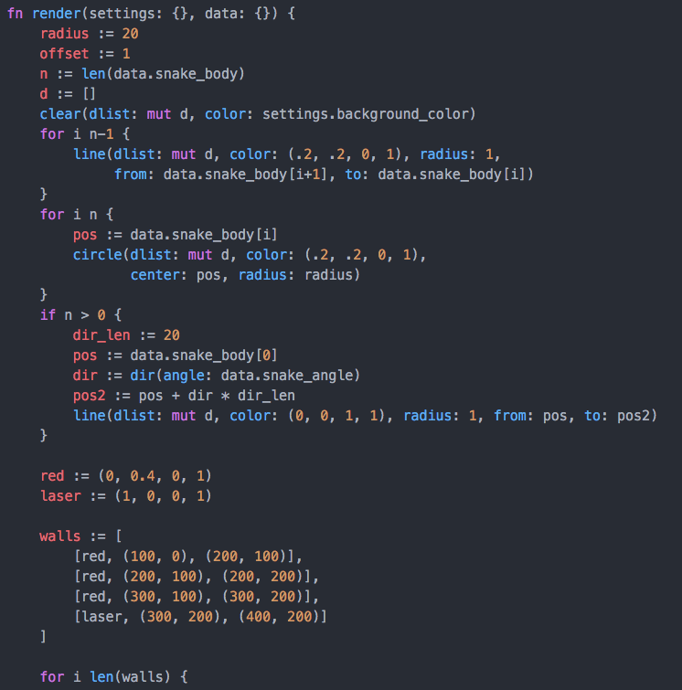

# dyon_for_atom
Dyon syntax highlighting for the Atom editor

Link: [Dyon programming language](https://github.com/pistondevelopers/dyon)



## How to install

Install the package language-dyon in Atom (Preferences->Packages) or Atom's package manager from a shell:

```
$ apm install language-dyon
```

## How to test changes (for developers)

1. Open up the Terminal window
2. Go to `~/.atom/packages`
3. Create a new folder `~/.atom/packages/language-dyon`
4. Copy the content of `editor-plugins/atom/` into the new folder
5. Restart Atom

Alternative to restart:

1. In Atom, go to the menu `Packages -> Command Palette -> Toggle`
2. Type "Window: Reload" and hit Enter

The window will flash for a moment and reload the packages.
